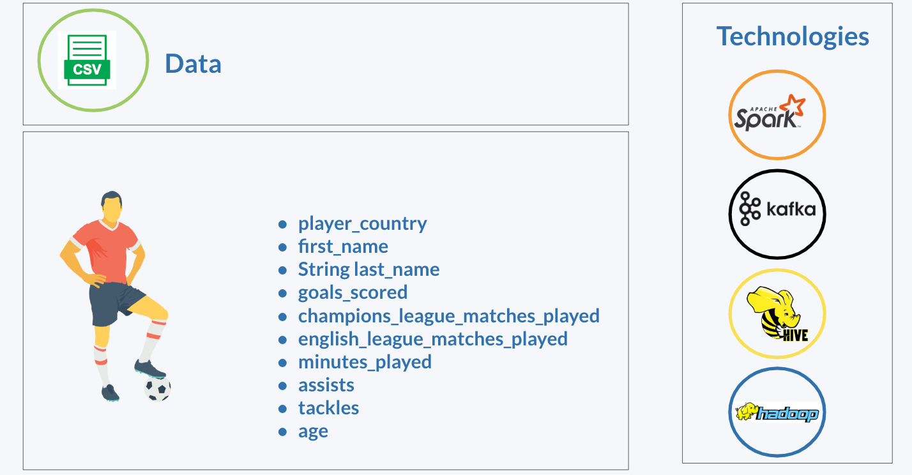
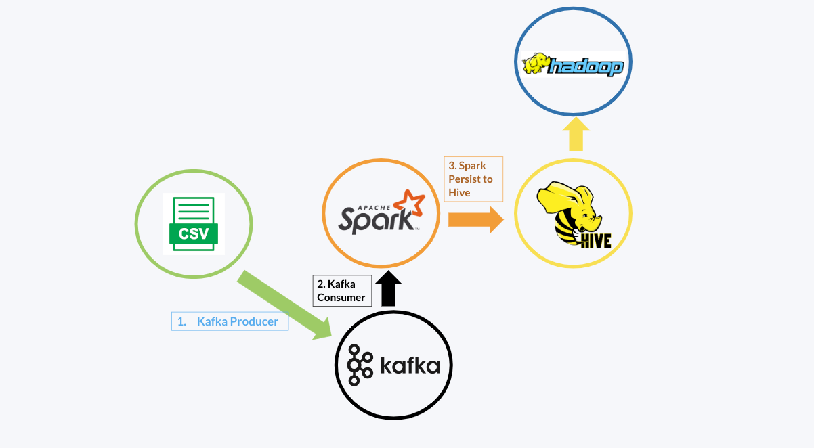

# Presentation Demo Video - https://shorturl.at/ceglV

# Project Overview 

# Data Flow



### Commadns to the run project


### Hadoop
```
sh: ./start-all.sh
sh: ./stop-all.sh
sh: jps (active hadoop process)
```

### Spark
```
sh: ./sbin/start-all.sh
sh: ./sbin/stop-all.sh
```

### Hive
```
sh: hive --service metastore & (thrift port opener)
sh: hive
```

### Derby
```
sh: startNetworkServer (starts thrift server port for connection)
```


### zookeeper
```
sh: sudo ./bin/zookeeper-server-start.sh config/zookeeper.properties
```

### Kafka
```
sh: ./bin/kafka-server-start.sh config/server.properties
```
